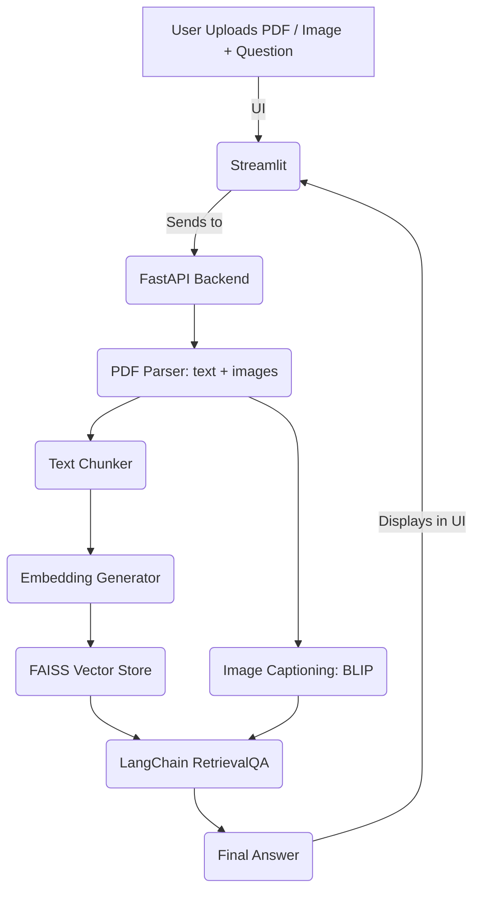

# README.md

## 📘 Multimodal RAG Pipeline for PDF & Visual Question Answering

This system enables question answering from PDF documents using both textual and visual (image-based) content. It leverages open-source LLMs, LangChain, Sentence Transformers, BLIP, and FAISS for fast retrieval and multimodal response generation.

---

## 📐 System Architecture



---

## ⚙️ Set-Up and Installation

### 1. Clone the Repository
```bash
git clone https://github.com/Ops-Sculptor/PDF_QA.git
cd multimodal-rag-pipeline
```

### 2. Install Dependencies
Make sure you have Python 3.10 or higher.
```bash
python -m venv venv
source venv/bin/activate  # or venv\Scripts\activate on Windows
pip install -r requirements.txt
```

### 3. Install NLTK Tokenizer (first run only)
```python
import nltk
nltk.download('punkt')
```

### 4. Start the Backend (FastAPI)
```bash
uvicorn main:app --reload
```

### 5. Start the Frontend (Streamlit)
```bash
streamlit run ui.py
```
## 📦 Project Requirements

Below are the core Python packages needed to run this project. These are included in `requirements.txt`:

```
fastapi==0.110.0
uvicorn[standard]==0.29.0
streamlit==1.32.2
PyMuPDF==1.23.22
pdfminer.six==20221105
sentence-transformers==2.2.2
nltk==3.8.1
faiss-cpu==1.7.4
langchain==0.1.16
transformers==4.40.1
torch==2.2.2
Pillow==10.2.0
accelerate==0.29.2
python-dotenv==1.0.1
requests==2.31.0
pytest==8.1.1
aiofiles==23.2.1
```

### Directory Structure:
```
project/
├── main.py                # FastAPI backend
├── ui.py                  # Streamlit frontend
├── pipeline.py            # End-to-end orchestrator
├── pdf_parser.py          # PDF text and image extraction
├── chunker.py             # Sentence-based text chunking
├── embedder.py            # Sentence Transformer embedding
├── vector_store.py        # FAISS storage and retrieval
├── qa_engine.py           # LangChain QA generation
├── vqa.py                 # Visual Question Answering (BLIP)
├── config.py              # Configuration constants
├── test_pipeline.py       # Unit and integration tests
├── requirements.txt       # Python dependencies
└── sample_data/           # Sample PDF and images for testing
```
## 🔌 API Usage

### 📤 POST `/process/`
Submit a PDF + text query and receive an answer.

#### Request:
- **Content-Type:** `multipart/form-data`
- **Parameters:**
  - `file`: PDF file
  - `query`: Textual question

#### Sample Code:
```python
import requests

files = {"file": open("sample.pdf", "rb")}
data = {"query": "What is the conclusion?"}
response = requests.post("http://localhost:8000/process/", files=files, data=data)
print(response.json())
```

#### Response:
```json
{
  "answer": "The document concludes with..."
}
```

---

## ✅ Features
- PDF text extraction and chunking
- Embedding with SentenceTransformers
- Visual image captioning with BLIP
- LangChain + Ollama RetrievalQA
- Fast and scalable with FAISS
- UI via Streamlit
- API via FastAPI

---

## 🧪 Testing
Run all unit and integration tests:
```bash
pytest test_pipeline.py --disable-warnings
```

Ensure `test_doc.pdf` and `test_image.jpg` are present in `sample_data/`.

---

## 🚀 To-Do / Roadmap
- [ ] Add support for image-based question routing
- [ ] Enhance OCR for scanned PDFs
- [ ] Deploy with Docker
- [ ] Add feedback ranking and retraining loop

---

## 👨‍💻 Author
Developed with precision for OceanAI Assignment. For Evaluation Assignment.
---
